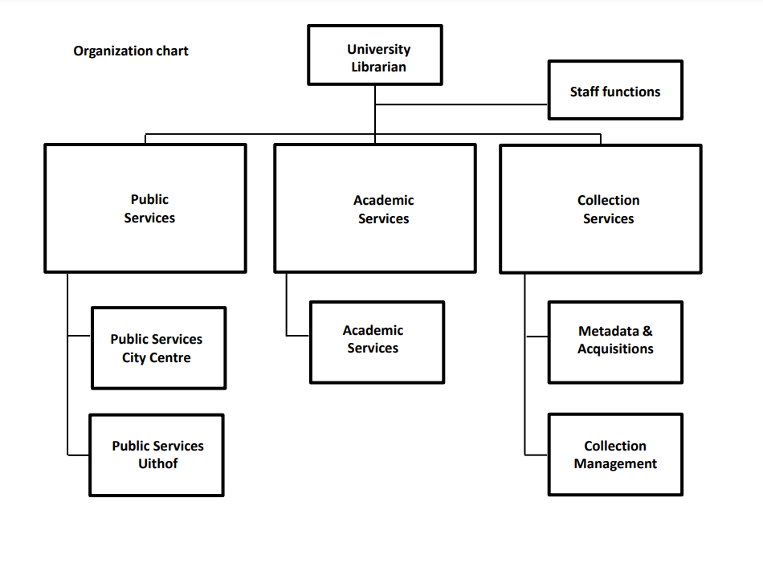

```{r setup, include=FALSE}
library(knitr)
library(rmdformats)

## Global options
options(max.print="75")
opts_chunk$set(echo=FALSE,
	             cache=TRUE,
               prompt=FALSE,
               tidy=TRUE,
               comment=NA,
               message=FALSE,
               warning=FALSE)
opts_knit$set(width=75)
```

# WELCOME

Welcome to [Utrecht University Library](https://www.uu.nl/en/university-library), Dorien! 

This onboarding document is meant to help you get you acquainted with our organization and team. 
<br> I hope it'll be useful and you have a nice start! </br>

As your buddy, I'll be around for any and all questions. 
<br> You can reach me anytime via [email](n.moopen@uu.nl) or MS Teams. </br> 

Lastly, as my previous buddy emphasized for me, HAVE FUN!

<center>


</center>

# GETTING STARTED

For your general administrative & HR-related practicalities, the [UU Intranet](intranet.uu.nl) is a good start! There is a whole section on _Information for New Employees_ that you can go through.

## Practical Things

Here's a checklist of things you can cover in your first days:

**Arrange Hardware & Software**

- [ ] Laptop
- [ ] Phone
- [ ] [Two-Factor Authentication](https://intranet.uu.nl/en/2fa)
- [ ] [VPN](https://manuals.uu.nl/en/handleiding/u-and-o-drive-on-windows-10-vpn/)

**Staff Access**

- [ ] UBU Employee Card
- [ ] [UU Campus Card](https://intranet.uu.nl/en/knowledgebase/campus-card)

**Administration & HR**

- [ ] Check out [Self-Service HR](https://selfservice.portal.uu.nl/irj/portal/hr/medewerker). 
- [ ] Fill in your work schedule on Self-Service HR
- [ ] Update your [personal profile page](https://intranet.uu.nl/en/knowledgebase/about-the-profile-pages)
- [ ] Check out [TopDesk](http://uu.topdesk.net/) - a self-service portal.

## New Staff Orientation Session

New staff members are always invited to an [orientation session](https://intranet.uu.nl/en/knowledgebase/new-staff-orientation-session). These take place 5 times a year. You'll receive an invitation via email about 4-6 weeks prior to the next meeting. 

Mine was online, I can't be sure sure if you'll get to attend an offline one. You'll find out soon enough!

## Campus Map

You likely know your way around as a UU-alum, but here's a [link](https://intranet.uu.nl/en/knowledgebase/buildings-and-maps) to maps of the campus - just in case you need them!

# UNIVERSITY LIBRARY

AKA. The coolest building(s) on campus.

<center>


</center>

## Organization

The Library consists of three divisions/sectors:

- Collection Services

- Academic Services 

- Public Services 

There is also: 

- _Stafdiensten_ which includes management support, communications, IT, facility management.

<center>



</center>

## Strategic Plan 2018-2020

You can read the UB's [Strategic Plan](https://www.uu.nl/sites/default/files/strategisch_plan_ub_2018-2020_engelstalig.pdf) here, but a new version will probably come along soon.

## The UB: Offline

As you know, the UB is situated in two locations: the Binnenstad (UBB) & Utrecht Science Part (USP). You'll mostly work at the USP, at the offices on the 2nd floor.  

We are still primarily working from home, but can choose to work on location once a week or so. For this you have to reserve a _werkplek_ and there's a Teams group (and Excel sheet within the Teams) to arrange this - _Reserveren werkplek UB_. You'll also be added to this group automatically.

FYI: Rooms 2.14 & 2.16 are the ones where most Academic Services/RDM Support staff work (as far as I know, I've been a 100% thuiswerker all this while).

## The UB: Online

- The UB has it's own [intranet](http://intranet.library.uu.nl), but FYI we are going to be migrating to a space _within_ the UU Intranet very soon. So maybe don't bookmark this link :P

- During coronatimes, the UB has it's own _UB Koffiehoek_ on Teams. You will be added to this group automatically. 

## Introductory Meetings

- You will be invited to an introduction meeting with Anja Smit (University Library / Director of the Library).

- You will also be invited to an _Introductiebijeenkomst voor nieuwe medewerkers'_.

## UB-wide meetings

- I(dee) D(elen) koffie
- I&D Bijeenkomst

You'll be invited to these automatically. These are meetings where colleagues across sectors come together to share updates and ideas.

## Bonus!

- If you would like to meet more of your colleagues in the UB, you can join the _Mystery Coffee_ organized within the UB Koffiehoek! 

 

# ACADEMIC SERVICES

This is our sector! <3 

## The Bosses

The managers of our sector include:

- **Division Manager**: Martine Pronk
- **Department Manager**: Coen Wilders 
- **Department Manager**: Kim Bergmans 

Kim is our direct manager, so you'll be in touch with her all the time. You'll be invited to (re-)introduction meetings with Martine & Coen.

## Faculty Liasions

To learn more about both our services and relations with respect to the UU faculties it is good to have meetings with faculty liaisons. They are considered to be the ones with in-depth knowledge about ‘who is who’ at the faculty-level. Faculty liaisons are the contacts of representation of the library at the faculties. Therefore, make an appointment with: 

- [ ] **Science**: Aleksandre Gogaladze
- [ ] **Veterinary Sciences**: Felix Weijdema
- [ ] **Humanities**: Rogier Schumacher
- [ ] **Medical Sciences**: Paulien Wiersma
- [ ] **Geosciences**: Jeroen Bosman
- [ ] **Law, Economics, and Government**: Sandrien Banens
- [ ] **Social Sciences**: Jan de Boer

## AS Teams

Academic Services is further organized into teams. For management purposes, these teams are divided between Coen & Kim. Each team has a contact person (or _aanspreekpunt_). It would be helpful to meet these contact persons and learn about what each team does and how we all fit together within the sector:

- [ ] **OPERA**: Felix Weijdema
- [ ] **Coding & Software**: N/A, you can talk to Bianca Kramer
- [ ] **Digital Humanities Support**: Puck Wildschut
- [ ] **Special Collections**: Marco van Egmond
- [ ] **Learning**: Marjan Groenouwe
- [ ] **ADD**: Desiree ten Dam & Rogier Schumacher
- [ ] **RDM Support**: Annemiek van der Kuil ** 
- [ ] **Publishing Support**: Fleur Stigter
- [ ] **Copyright Information Office**: Margriet Fokken & Judith Hanekuijk
- [ ] **BONUS -> Open Access Specialist:** Jeroen Sondervan

** Annemiek is currently out of office, so Neha (and the rest of RDM Support) will get you up to speed.

## AS Meetings

Currently, Academic Services gets together (via MS Teams) for a meeting every week or so. I have lost some sense of time due to the coronalife and I forgot how frequent they: weekly? biweekly? We have to ask Kim. These are just called the 'AS Meetings' and you will be invited to them automatically. 

They are not mandatory, but I'd recommend to attend them regularly. During these meetings, there is usually one presentation which serves as an update of what a particular person's/team's has been up to. 

# RDM SUPPORT 

This is your team! We are so happy to have you join us! <insert dancing The Office gif here>

- **Website**

Take some time to go through the RDM Support [website](https://www.uu.nl/en/research/research-data-management). It's our go-to page for researchers and staff. While you're at it, let us know if you have any feedback on improving the website. 

- **Newsletter**

We also have a [newsletter](https://mailings.uu.nl/hp/gKQRpokhPxN6bw8NlPTr8g/subscribe_newsletter_research_data_management_support) you should subscribe to.

- **RDM Policy @UU**

You can read the [University Framework for Research Data UU](https://www.uu.nl/sites/default/files/university_policy_framework_for_research_data_utrecht_university_-_january_2016.pdf). Faculties have their specific policies but this overarching one is a start.

## RDM within UB

**RDM Support Coordinator**

- [ ] Annemiek van der Kuil (out of office)

**Data Consultants**

- [ ] Mary Felix-Maina
- [ ] Jacques Flores

**Data Managers:** 

- [ ] Ron Scholten
- [ ] Danny de Koning-van Nieuwamerongen
- [ ] Otto Lange
- [ ] Neha Moopen

**Subject Specialists:** 

- [ ] Marie-Louise Goudeau
- [ ] Puck Wildschut 
- [ ] Sandrien Banens

As a start, you can plan a meeting with each members of each 'group' together. 

## RDM beyond the UB

RDM Support is a collaboration between the University Library (UB) & Information Technology Services (ITS).

However, the RDM Support 'network' goes well beyond the aforementioned units. For a sneak peek, check out the Prezi below that Annemiek would normally take you through.

<center>

<iframe src="https://prezi.com/embed/pfqxa1phi0mn/" id="iframe_container" frameborder="0" webkitallowfullscreen="" mozallowfullscreen="" allowfullscreen="" allow="autoplay; fullscreen" height="315" width="560"></iframe>

<center/>

The Department Manager of ITS is Frank Heere. Within ITS, the **Research Engineering** team and **Yoda Development Team** are among the ones we collaborate with a lot. The larger RDM Support 'network' also includes the Faculty Data Managers, Privacy Officers, Information Security Officers, Research Support Officers.

As a start, you can plan meetings with the following people:

- [ ] **Research Engineering**: Martine de Vos

- [ ] **Privacy @UB & @Veterinary Sciences**: Sanne Kleerebezem

- [ ] **Information Security**: Saskia van den Hout

- [ ] **Data Manager @Humanities**: Frans de Liagre-Bohl

- [ ] **Data Manager @Geosciences**: Vincent Brunst

- [ ] **RDM Coordinator @UMCU**: Irina van Dijk

Bonus Meetings:

- [ ] **Privacy @Geosciences**: Francisco Pastrana Romero

- [ ] **Privacy @Humanities**: Robert Steeman

- [ ] **Privacy @Beta**: Frans Huigen

**Note 1**: Sanne, Saskia, Francisco are closely involved in the Data Privacy Project. 

**Note 2:**: Robert & Frans are new to UU, they work a lot on privacy but they are also called 'data stewards' if I'm not wrong. Nice to hear more about their functions :)

## Meetings 

Meetings for RDM Support occur at different levels:

- [ ] **DMDC meeting:** Monthly meetings of the Data Consultants & Data Managers to update one another.

- [ ] **RDM Askathon:** A wholly informal and non-mandatory meeting of RDM colleagues within the library to ask each other RDM questions and learn from one another.

- [ ] **D-Lunch:** A monthly informal meeting with people from the larger RDM support network. Not mandatory, but recommended for a newbie.

- [ ] **RDM Expert Meeting:** A semi-formal meeting with people from the larger RDM Support network to dive into + discuss RDM-specific topics and issues.

- [ ] **UDMC Meeting:** I think we've only had one of these so far, and has been put on hold as Annemiek is out of office. It is a longer event with pre-planned presentations on major topics/developments within RDM Support.

## MS Teams

Make sure you're part of 2x teams for RDM Support: 

- [ ] RDM Support 

- [ ] Utrecht Data Management Community

# OPEN SCIENCE, FAIR, RDM @UU

## Open Science Community Utrecht

Not specifically RDM-focused, but a very important space to keep up with researchers! 

You can register on their [website](https://openscience-utrecht.com/). OSCU also has a Slack group that you can join!

They usually organize an _OSCoffee_ every month and there are larger faculty-specific open science symposiums organized through the year.

There is an 'OSCU Ambassador' at every faculty, you might see these researchers around - they're (obviously) more active than others in the field!

## Faculty Open Science Teams 

With Open Science becoming an important part of the UU's Strategic Plan, every Faculty has an Open Science Team now. They are composed of various 'Open Science Fellows' in addition to the OSCU Ambassadors and Faculty management. These 'Open Science Fellows' are appointed based on their specific interests: open access, FAIR Data & Software, Public Engagement, Recognition & Rewards.

You can learn more the FOSTs and the Open Science Fellows here: https://www.uu.nl/en/research/open-science/about-us/faculty-open-science-team

## FAIR Data & Software Track

Of the various tracks within the Open Science strategic goal, the FAIR Data & Software track is particularly relevant for us at RDM Support. Jacques is currently our representative in this working group.

# DEVELOPMENT

**coming soon**

- UU Development Guide
- Research Data Management courses/material
- Enterprise Data Management courses/material
- FAIR courses/material
- Data Privacy courses/material
- Programming courses/material

# LINKS & MORE LINKS

The actual links will be updated!

- UU Strategic Plan
- An [overview](https://intranet.uu.nl/kennisbank/abonneren-op-nieuwsbrieven) of ALL the UU newsletters. Subscribe to the ones you want!
- Landelijk Coordinatepunt Research Data Management (LCRDM)
- LCRDM Mailing List
- National Platform Open Science & NAtional Plan Open Science (NPOS)
- JISC
- JISC (UK) Research Data Management dicussion list
- LIBER
- Australian Research Data Commons (ARDC)
- Research Data Alliance (RDA)
- Open Data Institute (ODI)
- Open Knowledge Foundation (OKF)
- FAIRsFAIR
- Health-RI
- DANS
- CESSDA
- DDI
- GO-FAIR
- UK Data Service

