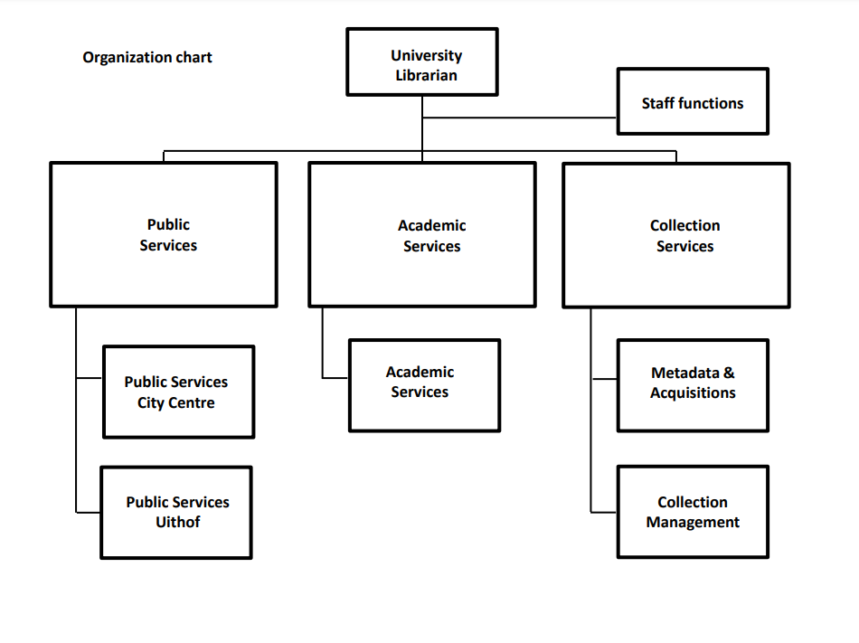

```{r setup, include=FALSE}
library(knitr)
library(rmdformats)

## Global options
options(max.print="75")
opts_chunk$set(echo=FALSE,
	             cache=TRUE,
               prompt=FALSE,
               tidy=TRUE,
               comment=NA,
               message=FALSE,
               warning=FALSE)
opts_knit$set(width=75)
```

# WELCOME

Welcome to [Utrecht University Library](https://www.uu.nl/en/university-library), Lena & Stefano! 

This onboarding document is meant to help you get you acquainted with our organization and team. 
<br> I hope it'll be useful and you have a nice start! </br>

As your buddies, we'll be around for any and all questions. 
<br> You can reach us anytime via [email](n.moopen@uu.nl) [email](d.jansen@uu.nl) or MS Teams. </br> 

Lastly, HAVE FUN!!

<center>


</center>

# GETTING STARTED

For your general administrative & HR-related practicalities, the [UU Intranet](intranet.uu.nl) is a good start! There is a whole section on _Information for New Employees_ that you can go through. The library has its own corner in the corporate environment [UBU Intranet](https://intranet.uu.nl/universiteitsbibliotheek)

## Practical Things

Here's a checklist of things you can cover in your first days:

**Arrange Hardware & Software**

- [ ] Laptop
- [ ] Phone
- [ ] [Two-Factor Authentication](https://intranet.uu.nl/en/2fa)
- [ ] [VPN](https://manuals.uu.nl/en/handleiding/u-and-o-drive-on-windows-10-vpn/)

**Staff Access**

- [ ] UBU Employee Card
- [ ] [UU Campus Card](https://intranet.uu.nl/en/knowledgebase/campus-card)

**Administration & HR**

- [ ] Check out [Self-Service HR](https://selfservice.portal.uu.nl/irj/portal/hr/medewerker). 
- [ ] Fill in your work schedule on Self-Service HR
- [ ] Update your [personal profile page](https://intranet.uu.nl/en/knowledgebase/about-the-profile-pages)
- [ ] Check out [TopDesk](http://uu.topdesk.net/) - a self-service portal.

## New Staff Orientation Session

New staff members are always invited to an [orientation session](https://intranet.uu.nl/en/knowledgebase/new-staff-orientation-session). These take place 5 times a year. You'll receive an invitation via email about 4-6 weeks prior to the next meeting. 

## Campus Map

You may already know your way around campus, but here's a [link](https://intranet.uu.nl/en/knowledgebase/buildings-and-maps) to maps of the campus - just in case you need them!

# UNIVERSITY LIBRARY

AKA. The coolest building(s) on campus.

<center>


</center>

## Organization

The Library consists of three divisions/sectors:

- Collection Services

- Academic Services 

- Public Services 

There is also: 

- _Stafdiensten_ which includes management support, communications, IT, facility management.

<center>



</center>

## Strategic Plan 2022-2025

You can read the UB's [Strategic Plan](https://intranet.uu.nl/system/files/UU%20UB%20Policy%20Plan%202022-2025%20-%204MB.pdf) here. We are still working on the yearplan for 2023.

## The UB: Offline

As you know, the UB is situated in two locations: the City Centre (UBB) & Utrecht Science Part (USP). You'll mostly work at the USP, at the offices on the 2nd floor. FYI: Rooms 2.14 & 2.16 are the ones where most Academic Services/RDM Support staff work. Our colleagues from IT (Research engineering) co-work in the Administrative Building (Bestuursgebouw) on Mondays and Thursdays in room 3.40, you are also welcome to join them. Team RDM works partly from home, and partly from the office. We prefer to do our meetings in person.

Note that there are a lot of initiatives you could join to meet colleagues. There is a Whatsapp group for people who like to take walks around the Science Park during lunchtime, there is a Whatsapp group for people who want to meet colleagues for lunch on the second floor. And AS is also organizing "ontmoetingslunches". Talk to Neha or me if you want to know more.

## The UB: Online

Our online activities are mostly through Teams. We have UBU-wide Koffiehoek, we have AS Teams, RDM Support Teams, and also the Utrecht Datamanagement Community Teams. We'll get you introduced everywhere. 

## Introductory Meetings

- You will be invited to an _Introductiebijeenkomst voor nieuwe medewerkers'_ when one is planned.

## UB-wide meetings

- I(dee) D(elen) koffie (weekly)
- I&D Bijeenkomst (quarterly)

You'll be invited to these automatically. These are meetings where colleagues across sectors come together to share updates and ideas.

 

# ACADEMIC SERVICES

This is our sector! <3 

## The Bosses

The managers of our sector include:

- **Division Manager**: Martine Pronk
- **Department Manager**: Kim Bergmans 
- **Department Manager**: Sven Raeymaekers 
- **Department Manager**: Wenneke Meerstadt 

Kim is our direct manager, so you'll be in touch with her all the time. You'll be invited to (re-)introduction meetings with Sven and Wenneke.

## Faculty Liasions

To learn more about both our services and relations with respect to the UU faculties it is good to have meetings with faculty liaisons. They are considered to be the ones with in-depth knowledge about ‘who is who’ at the faculty-level. Faculty liaisons are the contacts of representation of the library at the faculties. Therefore, make an appointment with: 

- [ ] **Science**: Aleksandre Gogaladze > will be leaving us soon, maybe meet with Andreas Franzke (information specialist)
- [ ] **Veterinary Sciences**: Felix Weijdema
- [ ] **Humanities**: Rogier Schumacher
- [ ] **Medical Sciences**: Najoua Ryane
- [ ] **Geosciences**: Jeroen Bosman
- [ ] **Law, Economics, and Government**: Sandrien Banens
- [ ] **Social Sciences**: Jan de Boer > is on sick leave for now, maybe meet with Erika Manten (information specialist)

## AS Teams

Academic Services is further organized into teams. For management purposes, these teams are divided between Kim, Sven and Wenneke. Each team has a contact person (or _aanspreekpunt_). It would be helpful to meet these contact persons and learn about what each team does and how we all fit together within the sector:

- [ ] **OPERA**: Felix Weijdema
- [ ] **Coding & Software**: Neha Moopen
- [ ] **Digital Humanities Support**: Arja Firet
- [ ] **Special Collections**: Marco van Egmond
- [ ] **Learning**: Marie-Louise Goudeau
- [ ] **ADD**: Desiree ten Dam & Rogier Schumacher
- [ ] **RDM Support**: Dafne Jansen
- [ ] **Publishing Support**: Jan de Boer
- [ ] **Copyright Information Office**: Saskia Manuela Bergmans & Judith Hanekuijk
- [ ] **BONUS -> Open Access Specialist:** Jeroen Sondervan

## AS Meetings

Currently, Academic Services gets together (via MS Teams) for a meeting every week or so. They are not mandatory, but I'd recommend to attend them regularly. During these meetings, there is usually one presentation which serves as an update of what a particular person's/team's has been up to. 

# RDM SUPPORT 

This is your team! We are so happy to have you join us! <insert dancing The Office gif here>

- **Website**

Take some time to go through the RDM Support [website](https://www.uu.nl/en/research/research-data-management). It's our go-to page for researchers and staff. While you're at it, let us know if you have any feedback on improving the website. 

- **Newsletter**

We also have a [newsletter](https://mailings.uu.nl/hp/gKQRpokhPxN6bw8NlPTr8g/subscribe_newsletter_research_data_management_support) you should subscribe to.

- **RDM Policy @UU**

You can read the [University Framework for Research Data UU](https://www.uu.nl/sites/default/files/university_policy_framework_for_research_data_utrecht_university_-_january_2016.pdf). Faculties have their specific policies but this overarching one is a start.

## RDM within UB

**Data Consultants**

- [ ] Dafne Jansen (also community manager)
- [ ] Jacques Flores
- [ ] Mary Felix-Maina > maternity leave

**Data Managers:** 

- [ ] Ron Scholten
- [ ] Dorien Huijser
- [ ] Otto Lange (he is our metadataspecialist)
- [ ] Neha Moopen (also coordinator sub-team Code and Software)

We also have 2 communication advisors that support us: Petra Davids and Marloes Beerling. 
	
## RDM beyond the UB

RDM Support is a collaboration between the University Library (UB) & Information Technology Services (ITS). In ITS, there are three teams we interact with regularly. The research engineering team, the devops team, and the team that has no name but deals with most research services (like PURE, MyPhd, Qualtrics). The department manager for all these teams is Frank Heere. Make sure you meet Martine de Vos, the others you will probably see during a D-Lunch.
	
**Team coordinators**

- [ ] Martine de Vos (research engineering)
- Rob van Schip (devops)
- Arjan Sieverink (services)
	
However, the RDM Support 'network' goes well beyond the aforementioned units. We will tell you more about the network and the idea of RDM Support central versus faculty support during your first weeks, and during the Intro to RDM @ UU training day.

As a start, you can plan meetings with the following people:

- [ ] **Privacy @UB & @Veterinary Sciences**: Pieter-Bas de Lange & Kasper de Bruijn

- [ ] **Information Security**: Saskia van den Hout

- [ ] **Data Manager @Humanities & REBO**: Frans de Liagre-Bohl

- [ ] **Data Manager @Geosciences**: Vincent Brunst
	
- [ ] **Data Manager @Humanities**: Frans de Liagre-Bohl

- [ ] **Data Manager @Social Sciences**: Dennis Hofman (he is a very busy guy so don't be alarmed if he does not answer his e-mail)

- [ ] **Data Manager @Science**: Frans Huigen & Mercedes Beltran
	
## FAIR Research IT

A particularly interesting program in the UU, is the FAIR Research IT program. The previous "edition" of this program led to the formation of RDM Support and the UDMC amongst other things. Read all about it on the [website](https://www.uu.nl/en/organisation/information-and-technology-services-its/what-we-do/research-and-it)

## Meetings 

Meetings for RDM Support occur at different levels:

- [ ] **DMDC meeting:** Monthly meetings of the Data Consultants & Data Managers to update one another.

- [ ] **RDM Askathon:** A wholly informal and non-mandatory meeting of RDM colleagues within the library to ask each other RDM questions and learn from one another. > Not happening regularly right now.

- [ ] **D-Lunch:** A twice a month informal meeting with people from the larger RDM support network. The focus of this group is collaboration between the library and ITS. Not mandatory, but recommended for a newbie.

- [ ] **RDM Expert Meeting:** A semi-formal meeting with people from the larger RDM Support network to dive into + discuss RDM-specific topics and issues. The focus of this group is aligning key players like RDM central, faculty support, privacy & information security.

- [ ] **UDMC Meeting:** A bimonthly semi-formal meeting with people from the regional network. The focus of this group is collaboration between UU and UMCU, but also other science park residents. 

## MS Teams

Make sure you're part of 2x teams for RDM Support: 

- [ ] RDM Support 

- [ ] Utrecht Data Management Community

# OPEN SCIENCE, FAIR, RDM @UU

## Open Science program
	
Read all about our open science program on their [website](https://www.uu.nl/en/research/open-science)

## Faculty Open Science Teams 

With Open Science being an important part of the UU's Strategic Plan, every Faculty has an Open Science Team now. They are composed of various 'Open Science Fellows' in addition to the OSCU Ambassadors and Faculty management. These 'Open Science Fellows' are appointed based on their specific interests: open access, FAIR Data & Software, Public Engagement, Recognition & Rewards.

You can learn more the FOSTs and the Open Science Fellows here: https://www.uu.nl/en/research/open-science/about-us/faculty-open-science-team

## FAIR Data & Software Track

Of the various tracks within the Open Science strategic goal, the FAIR Data & Software track is particularly relevant for us at RDM Support. Jacques is currently our representative in this working group.
	
## Open Science Community Utrecht

Not specifically RDM-focused, but a very important bottom up initiative to keep up with researchers! > This group used to be very active, but is a bit quiet at the moment...

You can register on their [website](https://openscience-utrecht.com/). OSCU also has a Slack group that you can join!

They usually organize an _OSCoffee_ every month and there are larger faculty-specific open science symposiums organized through the year.

There is an 'OSCU Ambassador' at every faculty, you might see these researchers around - they're (obviously) more active than others in the field!

# DEVELOPMENT

- UU Development Guide on [intranet](https://intranet.uu.nl/development-guide)
- Research Data Management courses/material
- Enterprise Data Management courses/material
- FAIR courses/material
- Data Privacy courses/material
- Programming courses/material

# LINKS & MORE LINKS

The actual links will be updated!

- UU Strategic Plan
- An [overview](https://intranet.uu.nl/kennisbank/abonneren-op-nieuwsbrieven) of ALL the UU newsletters. Subscribe to the ones you want!
- Landelijk Coordinatepunt Research Data Management (LCRDM)
- LCRDM Mailing List
- National Platform Open Science & NAtional Plan Open Science (NPOS)
- JISC
- JISC (UK) Research Data Management dicussion list
- LIBER
- Australian Research Data Commons (ARDC)
- Research Data Alliance (RDA)
- Open Data Institute (ODI)
- Open Knowledge Foundation (OKF)
- FAIRsFAIR
- Health-RI
- DANS
- CESSDA
- DDI
- GO-FAIR
- UK Data Service

